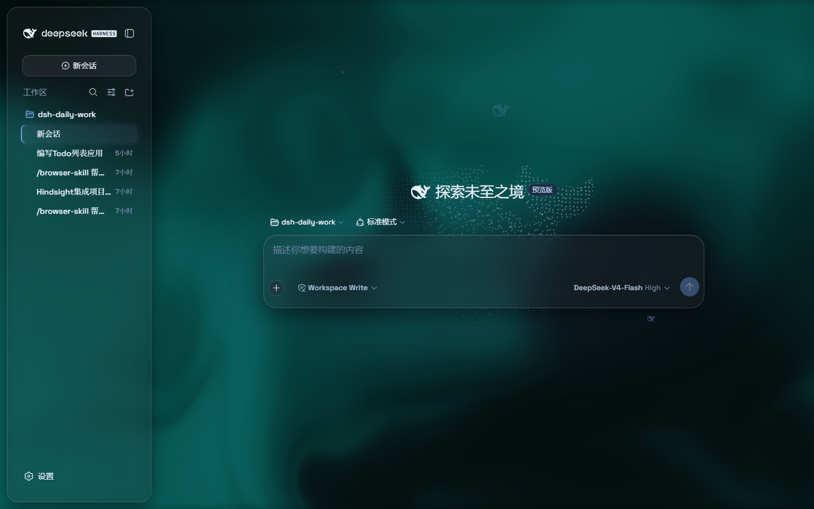
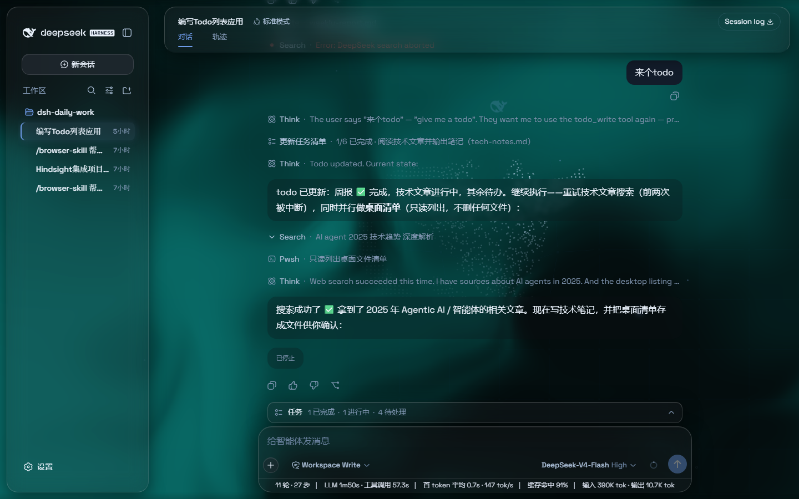
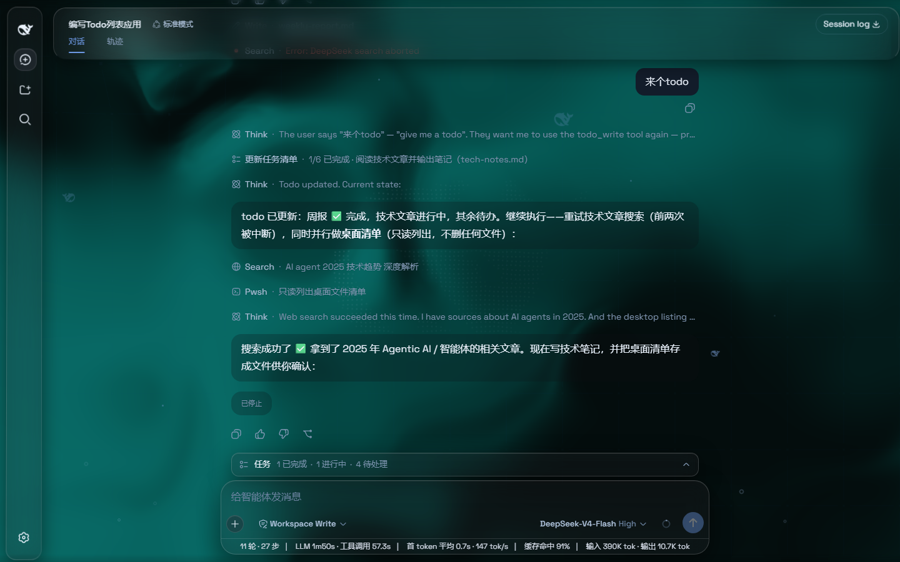

# dsh-nico-theme

English | [中文](README.zh.md)

A switchable **liquid-glass** theme for the [DeepSeek Harness](https://github.com/deepseek-ai/DeepSeek-Harness) web UI. Header, sidebar, composer, docks, and conversation pads become frosted panes over a living fluid backdrop (image or video wallpaper is optional). Turning the plugin off restores the stock UI — no DSH source changes.

Not affiliated with DeepSeek.

<p>
  
</p>

<p>
  
  
</p>

## Origins

This repository is a **fork** of [WYH66666666/DSH-Transparent-UI-Plugin](https://github.com/WYH66666666/DSH-Transparent-UI-Plugin) (MIT, © 2026 John Wu), adapted for **DSH 0.1.1-rc.2**.

The edge refraction — rounded-rect SDF displacement maps fed into SVG `feDisplacementMap`, then stacked with `backdrop-filter` blur — follows the copy-paste liquid-glass shader in [shuding/liquid-glass](https://github.com/shuding/liquid-glass) (MIT, © Shu Ding).

## Features

- **Mica** floating glass cards, or **compat** mode (stock layout, frosted material)
- Fluid backdrop with hue / depth knobs; optional image or video wallpaper
- Liquid-glass refraction on header, sidebar, composer, docks, takeovers, jobs popover
- Conversation reading pads (user bubbles and assistant prose only)
- Cursor spotlight, hover tilt, and a 1px pointer rim (each toggleable)
- No adaptive text color

## Requirements

- `@deepseek-ai/dsh@0.1.1-rc.2` (or newer in the 0.1.1 line)
- Node.js 22+

## Install

From a clone (recommended while the package is not on npm):

```sh
git clone https://github.com/more-nico/dsh-nico-theme.git
cd dsh-nico-theme
pnpm install
pnpm bundle
dsh plugin --profile web add .
```

Restart `dsh web`. Enable **Nico glass theme** in Settings → Plugins. Knobs sit under Settings → General → Appearance.

An isolated profile is safer for trying it out (it never touches the daily `web` profile):

```sh
dsh plugin --profile nico-theme-test add .
dsh --profile nico-theme-test --host 127.0.0.1 --port 18765 --no-open
```

## Develop

```sh
pnpm install
pnpm bundle
pnpm visual          # Playwright checks against the test profile
pnpm readme-shots    # refresh the dark-fluid images in assets/
```

## License

[MIT](LICENSE)

- Fork of [DSH-Transparent-UI-Plugin](https://github.com/WYH66666666/DSH-Transparent-UI-Plugin) (MIT)
- Liquid-glass refraction technique from [shuding/liquid-glass](https://github.com/shuding/liquid-glass) (MIT)
