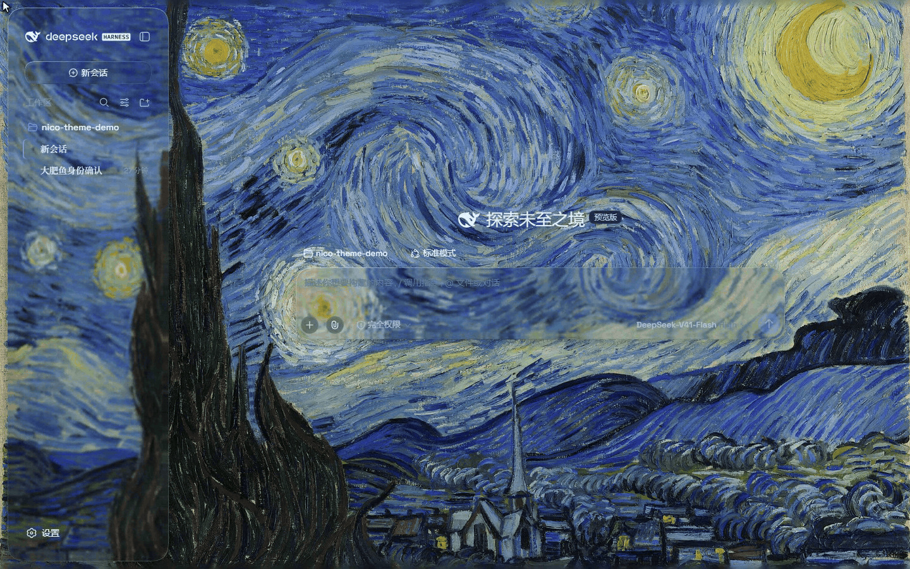
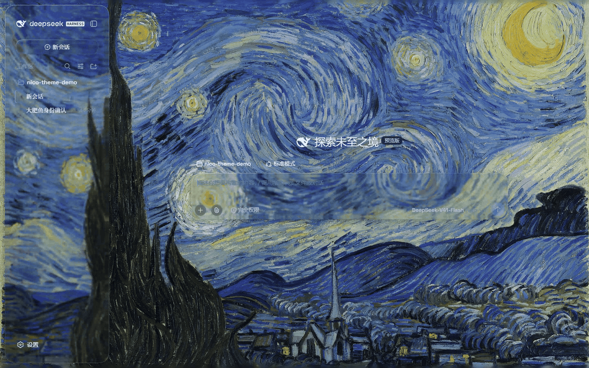

# dsh-nico-theme

[](https://www.npmjs.com/package/dsh-nico-theme) [](LICENSE) [](https://www.npmjs.com/package/@deepseek-ai/dsh) [](https://github.com/more-nico/nico-glass-kit)

[English](README.md) | 中文 · [更新日志](CHANGELOG.md)

给 [DeepSeek Harness](https://github.com/deepseek-ai/DeepSeek-Harness) 网页端用的可开关 **液态玻璃** 主题。顶栏、侧栏、发送框、各类停靠条和会话垫层变成磨砂玻璃，底下是可调的流体背景（也可换图片 / 视频壁纸）。关掉插件即回到原生界面，不改 DSH 源码。

<p>
  
</p>

*悬停弹性，以最大强度（0.5）录制，默认值是 0.2。*

---

## 目录

- [这是什么](#这是什么)
- [亮点](#亮点)
- [图示](#图示)
- [来源](#来源)
- [环境](#环境)
- [安装](#安装)
- [开发](#开发)
- [许可](#许可)

## 这是什么

一个 DSH 客户端插件。面板玻璃由 [nico-glass-kit](https://github.com/more-nico/nico-glass-kit) 渲染：每个面板 portal 一层 `GlassSurface`，背景走 SVG 位移滤镜，玻璃沿圆角真实弯折画面，而不只是模糊。流体背景、壁纸层与会话垫层是本仓库自己的 CSS / canvas 实现。与 DeepSeek 官方无关。

## 亮点

- **云母** 浮动玻璃面板（统一 32px 圆角，nico-glass-kit 材质），或 **兼容** 模式（原生布局 + 磨砂材质）
- 14 个面板全部铺上：顶栏 / 侧栏 / 发送框 / 各 dock / 弹窗 / 后台任务 popover / 新建会话胶囊
- 流体背景（色调 / 深浅可调）；可选图片或视频壁纸，壁纸自带模糊滑杆
- 按 kit 刻度调节材质：模糊度、亮度、折射强度、折射深度、边缘曲率、边缘色散、边缘高光
- 悬停 **弹性**：玻璃与面板内容一起倾斜；自己裁剪溢出的宿主保持刚性，`prefers-reduced-motion` 下整体停用
- 会话阅读垫层（只垫用户气泡和 AI 主正文）
- 不含自适应字色

## 图示

**起始页** — 玻璃发送框浮在流体背景上。

<p>
  
</p>

**会话与收起侧栏** — 玻璃顶栏、待办条与阅读垫层，底下是流体背景。

<p>
  
  
</p>

**设置页** — Nico 主题页集中所有材质旋钮；片段里把壁纸模糊度拖到 3px。

<p>
  
</p>

## 来源

本仓库是 [WYH66666666/DSH-Transparent-UI-Plugin](https://github.com/WYH66666666/DSH-Transparent-UI-Plugin) 的 **fork**（MIT，© 2026 John Wu），适配 **DSH 0.1.2-rc.1**。

面板玻璃（折射、倒角、着色、边缘高光、弹性）由 [nico-glass-kit](https://github.com/more-nico/nico-glass-kit)（`^0.3.0`，MIT）渲染；流体背景、壁纸层与会话垫层是本仓库自己的 CSS / canvas 实现。

## 环境

- `@deepseek-ai/dsh@0.1.2-rc.1`（或 0.1.2 更新的 rc）
- Node.js 22+
- 折射需要 Chromium 系浏览器；Firefox 和 Safari 自动退回 kit 的普通 CSS 磨砂

## 安装

DSH 插件装在 **profile** 里，不是全局 `dsh`。`dsh plugin add` 会在该 profile 里跑 pnpm；本包装了 `dsh.bundle`，所以会**自动写进** `dsh.profile.bundles`。然后重启这个 profile。

### 日常网页端

```sh
dsh plugin --profile web add dsh-nico-theme@latest
```

然后重启 `dsh web`。在 **设置 → 插件** 打开 **Nico 玻璃主题**。所有旋钮都在设置左侧导航的 **Nico 主题** 独立页。

### 单独试、不动日常 `web`

```sh
dsh plugin --profile nico-theme-test add dsh-nico-theme@latest
dsh --profile nico-theme-test --host 127.0.0.1 --port 18765 --no-open
```

以后更新还是这条命令（`@latest`），或 `dsh plugin --profile web update`。卸掉：`dsh plugin --profile web remove dsh-nico-theme`。

### 本地开发

```sh
pnpm install && pnpm bundle
dsh plugin --profile nico-theme-test add .
```

## 开发

```sh
pnpm install
pnpm bundle          # tsdown + lib/types/*.d.ts
pnpm typecheck       # 用已安装的 DSH client 包跑 tsc --noEmit
pnpm visual          # 对测试 profile 跑 Playwright
pnpm readme-shots    # 刷新 assets/ 里的深色流体截图
pnpm readme-gifs     # 录制 assets/*.gif（需 NICO_THEME_URL；设置页那段还需 NICO_WALLPAPER）
```

玻璃材质本身在 [nico-glass-kit](https://github.com/more-nico/nico-glass-kit)；本仓库负责把它挂到 DSH 的面板上，并把设置页接到它的旋钮上。

维护者：`npm login`，然后 `git tag v0.1.0 && git push origin v0.1.0`。GitHub Actions 会发 npm（仓库要有 `NPM_TOKEN`）。也可以本地 `pnpm bundle` 后 `pnpm publish`。

## 许可

[MIT](LICENSE)

- Fork 自 [DSH-Transparent-UI-Plugin](https://github.com/WYH66666666/DSH-Transparent-UI-Plugin)（MIT）
- 玻璃材质来自 [nico-glass-kit](https://github.com/more-nico/nico-glass-kit)（MIT）

`assets/` 里的截图与动图在本地测试 profile 上录制，背景为梵高《星月夜》（1889，公有领域）。
